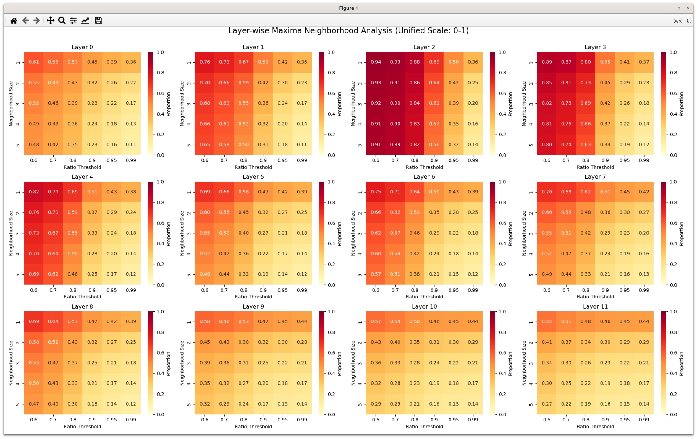

# Clustered Maxima: A Unified Semantic and Numerical Perspective on Efficient Online Softmax

> **Keywords**: Clustered Maxima · Locality · Online Softmax · Transformer · Attention

## Core Insight

**The semantic structure of natural language—where related concepts cluster together—creates exploitable numerical patterns in attention scores.** These patterns enable efficient softmax computation through coarse sampling and local refinement, reducing complexity from O(n) to O(n/Δ + r).

---

## Background: The QK^T Matrix in Transformer Attention

### From Input to Attention Scores

The Transformer takes an input embedding matrix X ∈ ℝ^{n × d}, where n is sequence length and d is embedding dimension. Attention computes:

- Q = XW_q (Query projection)
- K = XW_k (Key projection)  
- V = XW_v (Value projection)

The attention score matrix is QK^T / √d_k, representing similarity between each Query and all Keys.

### Matrix Expansion: XW_q W_k^T X^T

Substituting the definitions:

$$
QK^T = (XW_q)(XW_k)^T = XW_q W_k^T X^T
$$

This n × n matrix captures pairwise relevance across the sequence:

- **Row view**: Row i shows how Query token i relates to all Keys—"Which tokens should I attend to?"
- **Column view**: Column j shows how Key token j is attended by all Queries—"Which tokens attend to me?"

### Semantic Interpretation

QK^T is not just a numerical matrix—it quantifies "dialogue between tokens":

- Coreference relationships (e.g., "animal" ↔ "it") produce high scores
- Syntactic structures create patterned high-score regions
- Training learns W_q and W_k that bring semantically related tokens closer in projection space

---

## What is "Clustered Maxima"?

### Linguistic Intuition: Attention is Not Point-to-Point

Consider the sentence:

> "The animal didn't cross the street because it was too tired."

When "it" (token 8) queries the sequence:
- High score on "animal" (coreference)
- Also high scores on "The", "didn't"—they form a semantic unit with "animal"
- Lower scores on unrelated tokens like "street"

The attention row might look like:

```
Token:  The   animal  didn't  cross  the   street  because  it   was   too   tired
Score:  0.6   0.9     0.8     0.3    0.1   0.05    0.4      0.5  0.6   0.6   0.8
```

**Key observation**: High values form a contiguous region, not an isolated spike. This is **Clustered Maxima**.

---

## From Semantic Phenomenon to Numerical Structure

### 1. Continuity and Smoothness

In well-trained Transformers, Key vectors vary continuously with semantics. Adjacent tokens with similar meanings produce similar attention scores:

$$
|s_i(j) - s_i(j+1)| \le L
$$

where L is a Lipschitz constant. The score sequence has no abrupt jumps.

### 2. Clustered Maxima Property

Due to local semantic coherence, maxima appear in **plateaus** rather than isolated peaks:

```
[0.75, 0.89, 0.94, 0.97, 0.96, 0.90, 0.45, ...]
        ↑↑↑↑↑  ← High-score cluster
```

Mathematically, there exists a radius r such that:

$$
s_i(j) \approx \max(s_i) \quad \text{for } |j - j^*| \le r
$$

---

## Empirical Evidence from GPT-2

To validate the Clustered Maxima hypothesis, we analyzed attention patterns across all 12 layers of GPT-2. For each attention row, we examined what proportion of maximum values have neighbors (within a given neighborhood size) that reach a specified ratio threshold of the maximum.


*Figure: Layer-wise Maxima Neighborhood Analysis across GPT-2's 12 attention layers. Each heatmap shows the proportion of attention rows where neighbors within a given neighborhood size reach the specified ratio threshold of the row maximum.*

### Reading the Heatmaps

- **X-axis (Ratio Threshold)**: The proportion of maximum value that neighbors must reach (e.g., 0.8 means 80% of max)
- **Y-axis (Neighborhood Size)**: How many positions before/after the maximum to consider (e.g., 1 means ±1 positions)
- **Cell values**: Proportion of attention rows satisfying the condition

For example, if Ratio Threshold = 0.8 and Neighborhood Size = 2, a cell value of 0.70 means that in 70% of attention rows, at least one element within ±2 positions of the maximum reaches 80% of the maximum value.

### Key Findings

The heatmaps reveal a consistent pattern: **maxima are rarely isolated**.

1. **Even under strict conditions** (Ratio Threshold = 0.99, Neighborhood Size = 1), 10-15% of maxima have immediate neighbors reaching 99% of their value.

2. **Under practical conditions** (Ratio Threshold = 0.8, Neighborhood Size = 2), this proportion rises to **50-70%** across most layers.

3. **Layer 2 shows particularly strong clustering** (0.89-0.94 in the upper-left region), suggesting highly concentrated attention patterns—possibly corresponding to specific linguistic functions like syntactic parsing.

4. **Deeper layers (8-11) show weaker clustering**, which may reflect more distributed, abstract semantic processing.

### Implications for Sampling-Based Optimization

This empirical evidence supports the theoretical basis for sampling-based maximum estimation:

- If we sample within a small neighborhood of the true maximum, we are highly likely to find values close enough for numerically stable softmax computation
- The clustering is strong enough that even coarse sampling (every 8-16 positions) has a good chance of landing near the true maximum
- Some attention layers with maximum scores exceeding 20 still exhibit this clustering property, confirming robustness even for high-magnitude attention patterns

---

## Algorithmic Implications: Efficient Online Softmax

### The Problem: Why is Softmax Slow?

Standard softmax requires:

$$
\text{softmax}(s_i) = \frac{\exp(s_i - \max(s_i))}{\sum_j \exp(s_j - \max(s_i))}
$$

Finding max(s_i) requires scanning all Keys—O(n) complexity, problematic for sequences of 64k+ tokens.

### The Insight: If Maxima Cluster, We Can Sample

Given:
- **Continuity**: Adjacent scores differ by at most L
- **Clustering**: Maximum lies within a high-value plateau

We can:
1. **Coarse sampling**: Compute dot products every Δ Keys
2. **Locate approximate peak**
3. **Local refinement**: Precise computation only within radius r of peak

### Algorithm Overview

| Phase | Operation | Complexity |
|-------|-----------|------------|
| Step 1: Coarse sampling | Compute q_i · k_j every Δ Keys | O(n/Δ) |
| Step 2: Local refinement | Exact computation within radius r | O(r) |

**Total complexity**: O(n/Δ + r) ≪ O(n)

Typical parameters: Δ = 8–16, r = 32–64  
→ Only **5–10%** of original computation

---

## Error Analysis and Numerical Stability

### Error Bound

From Lipschitz continuity:

$$
|\max(s_i) - \tilde{m}| \le L\Delta
$$

where $\tilde{m}$ is the estimated maximum from coarse sampling.

### Safety Margin for Numerical Stability

To prevent underestimating the maximum (which could cause overflow):

$$
\tilde{m}_{\text{safe}} = \tilde{m} + \delta, \quad \delta \approx 1.0 \sim 2.0
$$

This ensures:

$$
\exp(s_i - \tilde{m}_{\text{safe}}) \le 1
$$

---

## Unified Perspective: Semantics, Numerics, and Engineering

| Level | Meaning of Clustered Maxima | Practical Value |
|-------|----------------------------|-----------------|
| **Semantic** | Attention focuses on semantic clusters (e.g., "the animal didn't cross") | Understanding how models capture context |
| **Numerical** | Attention scores form smooth local plateaus | Enables sampling and local refinement |
| **Engineering** | Compute softmax only in plateau regions | Dramatically reduces inference cost |

**The key insight**: Transformer's semantic redundancy—"similar words score high together"—creates algorithmic redundancy that allows us to safely skip irrelevant regions.

---

## Hardware Considerations

On accelerators like Huawei Ascend NPUs:

- **Coarse sampling and local refinement** can run in parallel
- **Sequential memory access** optimizes sampling phase
- **Dual vector units** enable pipelined execution

This enables end-to-end **Online Softmax acceleration** with significant inference throughput improvements.

---

## Summary

| Concept | Semantic Meaning | Numerical Meaning |
|---------|-----------------|-------------------|
| Locality | Smooth semantic transitions | Enables large sampling stride |
| Clustered Maxima | Conceptual cluster associations | Local refinement suffices |
| Error Control | Robust attention | Tunable precision-speed tradeoff |
| Safety Margin | Avoid numerical overflow | Improved stability |

---

## Conclusion: Bridging Language and Computation

> Transformer attention is not just a semantic mechanism—it's a computable pattern:
> 
> **Semantic clusters determine numerical plateaus;  
> Numerical plateaus inspire efficient Online Softmax.**

This is the elegance of Clustered Maxima—it is simultaneously how language models understand the world and how engineers optimize computation.

The semantic structure of natural language, far from being an obstacle to efficiency, becomes the very foundation for algorithmic acceleration.