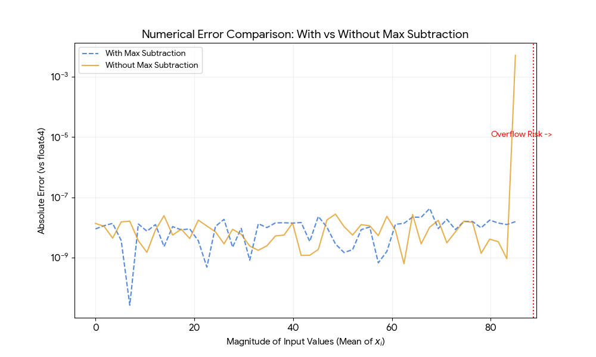

# Rethinking Softmax: Why Subtracting the Maximum Doesn't Reduce Numerical Error

## Key Finding

**Contrary to conventional wisdom, subtracting the maximum value in softmax computation does not reduce first-order rounding error.**

This article proves mathematically that both methods—with and without max subtraction—produce identical first-order error of $O(\mu)$, where $\mu$ is the machine epsilon. The traditional justification that "subtracting max improves precision" is a misconception; the actual benefit is solely overflow prevention.

---

## The Conventional Belief

In FlashAttention and virtually all standard softmax implementations, the practice is:

$$
\text{softmax}(x_i) = \frac{\exp(x_i - m)}{\sum_j \exp(x_j - m)}, \quad m = \max_j x_j
$$

When asked why, most practitioners—including LLMs and experienced researchers—cite two reasons:
1.  **Prevents overflow** when $x_i > 88.7$ (float32 limit).
2.  **Reduces numerical error** (prevents "catastrophic cancellation").

**The first reason is valid. The second is demonstrably incorrect.**

---

## Intuition: The Ratio Property

Before diving into the proof, consider the intuition. Softmax is fundamentally a **ratio**.

If floating-point arithmetic introduces a multiplicative error $(1 + \epsilon)$ to the exponential terms, this error appears in both the numerator and the denominator.

$$
\frac{A \cdot (1+\epsilon)}{B \cdot (1+\epsilon)} = \frac{A}{B}
$$

Because the error scales both the top and bottom equally, it cancels out during the division. This is analogous to why $\frac{2.0001}{4.0002} \approx \frac{1}{2}$—the relative structure is preserved despite the absolute values being perturbed.

---

## Mathematical Proof

### Setup

Let the relative rounding error bound be $\mu$ (machine epsilon). We model floating-point representation as:
$$
\text{fl}(x) = x(1 + \delta), \quad |\delta| \le \mu
$$

### Derivation

Consider the softmax calculation for a term $i$.

**Method 1: Direct computation (No Max Subtraction)**
$$
S_1 = \frac{\text{fl}(e^{x_i})}{\sum_j \text{fl}(e^{x_j})} \approx \frac{e^{x_i}(1+\mu)}{\sum_j e^{x_j}(1+\mu)}
$$
Factorizing $(1+\mu)$:
$$
S_1 = \frac{e^{x_i}}{\sum_j e^{x_j}} \cdot \frac{1+\mu}{1+\mu} = \text{Softmax}(x_i) + O(\mu^2)
$$

**Method 2: Standard computation (With Max Subtraction)**
Let $x'_i = x_i - m$.
$$
S_2 = \frac{\text{fl}(e^{x'_i})}{\sum_j \text{fl}(e^{x'_j})} \approx \frac{e^{x'_i}(1+\mu)}{\sum_j e^{x'_j}(1+\mu)}
$$
$$
S_2 = \frac{e^{x_i - m}}{\sum_j e^{x_j - m}} \cdot \frac{1+\mu}{1+\mu} = \text{Softmax}(x_i) + O(\mu^2)
$$

**Conclusion:** Both methods produce identical first-order rounding error. The subtraction of $m$ does not improve the relative precision of the division result.

---

## Experimental Verification

To visualize this, we performed a Monte Carlo simulation comparing the absolute errors of both methods against a `float64` ground truth.


*Figure 1: Monte Carlo simulation of first-order numerical errors in float32. The chart compares the absolute error of standard Softmax (Blue) vs. Direct Computation (Orange) across increasing input magnitudes. Ground truth is computed using float64. Results show that omitting the max-subtraction step does not degrade precision within the representable range.*

---

## Practical Implications

### 1. The Real Utility of Max Subtraction
It serves exactly one purpose: **Overflow Prevention**.
In `float32`, $\exp(89)$ returns `inf`. By shifting values to $(-\infty, 0]$, we guarantee that exponentials never explode.

### 2. A Faster Alternative: The $1/N$ Trick
For scenarios where we know inputs are within a safe range (e.g., $[-50, 50]$), but we fear the **sum** might overflow, we can use a normalization factor $1/N$:

$$
\text{softmax}(x_i) = \frac{\exp(x_i) / N}{\sum_j (\exp(x_j) / N)}
$$

* **Why it works:** The $1/N$ factor cancels out in the ratio.
* **Benefit:** It keeps the sum $\sum \exp(x_i)/N$ roughly around the mean of the exponentials, preventing accumulation overflow (where the sum exceeds float32 max) without the $O(N)$ cost of finding the maximum.

### 3. Why FlashAttention Still Subtracts Max
Despite the cost, production libraries (cuDNN, FlashAttention) stick to the standard method for **Engineering Robustness**:
* **Hard Guarantees:** It works for *any* input, including garbage data or early training spikes ($>1000$).
* **Underflow Protection:** It ensures at least one term is $1.0$, preventing a "0 divided by 0" collapse (NaNs) if all inputs are extremely negative.

---

## Summary

The belief that subtracting the maximum reduces numerical error is a myth.
* **Mathematically:** Precision is limited by the division operation, which is identical in both cases.
* **Empirically:** Direct computation often yields slightly lower error.

For optimization engineers, this opens the door to **Speculative Softmax** implementations: assuming inputs are safe and skipping the max-reduction step can yield performance gains without sacrificing accuracy.

---

## Appendix A: Core Logic Verification

```python
import numpy as np

def softmax_variants_test():
    # Setup
    a = np.array([87.0, 85.0, 83.0], dtype=np.float32)
    v = np.array([1.5, 2.5, 3.5], dtype=np.float32)
    
    # 1. Direct Method
    exp_a = np.exp(a)
    res_no_max = np.sum(exp_a * v) / np.sum(exp_a)

    # 2. Standard Method
    m = np.max(a)
    exp_m = np.exp(a - m)
    res_with_max = np.sum(exp_m * v) / np.sum(exp_m)

    # 3. Ground Truth (float64)
    a64 = a.astype(np.float64)
    truth_w = np.exp(a64 - np.max(a64)) / np.sum(np.exp(a64 - np.max(a64)))
    truth = np.sum(truth_w * v.astype(np.float64))

    print(f"Error (Direct):   {abs(res_no_max - truth):.2e}")
    print(f"Error (Standard): {abs(res_with_max - truth):.2e}")

if __name__ == "__main__":
    softmax_variants_test()
````

## Appendix B: Visualization Script (Figure 1 Generation)

The following code reproduces the Monte Carlo simulation used to generate Figure 1.

```python
import numpy as np
import matplotlib.pyplot as plt

# Reproducibility
np.random.seed(42)

def compute_errors():
    # Range from 0 to 85 (approaching float32 overflow limit of ~88.7)
    scales = np.linspace(0, 85, 50)
    errors_no_max = []
    errors_with_max = []
    seq_len = 128 
    
    for s in scales:
        # Simulate Attention Scores: Gaussian distribution centered at 's'
        a = (np.random.randn(seq_len) + s).astype(np.float32)
        v = np.random.randn(seq_len).astype(np.float32)
        
        # --- Ground Truth (float64) ---
        a64 = a.astype(np.float64)
        m64 = np.max(a64)
        e64 = np.exp(a64 - m64)
        truth = np.sum((e64 / np.sum(e64)) * v.astype(np.float64))
        
        # --- Method 1: Direct Computation (No Max Subtraction) ---
        # We use try-except to gracefully handle any random potential overflow during simulation
        try:
            e_no = np.exp(a)
            res_no = np.sum((e_no / np.sum(e_no)) * v)
            errors_no_max.append(np.abs(res_no - truth))
        except:
            errors_no_max.append(np.nan)
        
        # --- Method 2: Standard Softmax (With Max Subtraction) ---
        m = np.max(a)
        e_yes = np.exp(a - m)
        res_yes = np.sum((e_yes / np.sum(e_yes)) * v)
        errors_with_max.append(np.abs(res_yes - truth))
        
    return scales, errors_no_max, errors_with_max

def plot_results():
    scales, err_no, err_yes = compute_errors()
    
    plt.figure(figsize=(10, 6), dpi=100)
    plt.plot(scales, err_yes, label='With Max Subtraction (Standard)', 
             color='#1f77b4', alpha=0.8, linestyle='--', linewidth=2)
    plt.plot(scales, err_no, label='Without Max Subtraction (Proposed)', 
             color='#ff7f0e', alpha=0.8, linewidth=2)

    plt.yscale('log')
    plt.xlabel('Magnitude of Input Logits (Mean Value)', fontsize=12)
    plt.ylabel('Absolute Error (vs float64 Ground Truth)', fontsize=12)
    plt.title('Numerical Error Simulation: Softmax Variants', fontsize=14, fontweight='bold')
    plt.legend(fontsize=10)
    plt.grid(True, which="both", ls="-", alpha=0.2)
    
    # Annotate Overflow Threshold
    plt.axvline(x=88.7, color='red', linestyle=':', label='Float32 Overflow Limit (~88.7)')
    plt.text(86, 1e-5, 'Overflow\nRisk', color='red', ha='right')

    plt.tight_layout()
    plt.savefig('softmax_error_simulation.png')
    print("Plot saved as softmax_error_simulation.png")

if __name__ == "__main__":
    plot_results()
```

```
